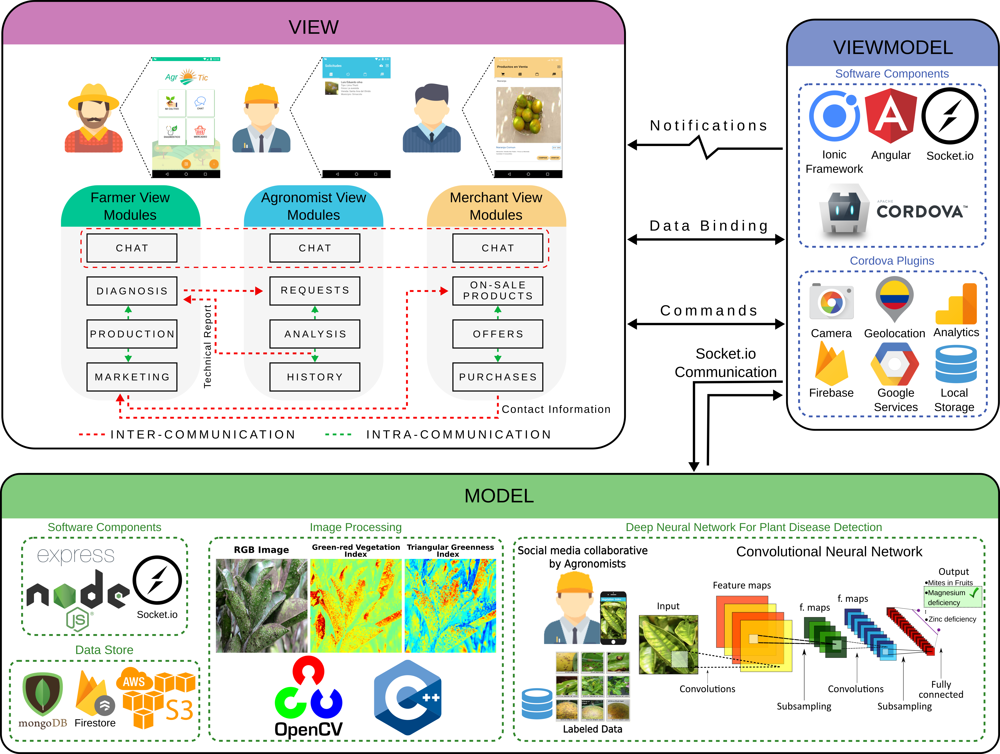

The Food and Agriculture Organization of the United Nations (FAO) has defined that agriculture is the main source of food supply given the high demand related to the population growth. Therefore, the FAO has also defined the trend to increase agricultural productivity based on the use of technology, information, and com- munication (ICT) tools. Nowadays, recent ICT tools like smartphones, cloud computing, Internet of Things (IoT), and big data support the implementation of precision agriculture to improve crops and their management. Colombia is an abundant country with suitable soils for the cultivation of diverse types of crops. However, the unknown ICT advantages for the farmers and the user rejection to adopt new technology difficult ICT implementation in the Colombian agriculture. On the other hand, the use of smartphones in various industrial applications has brought several advantages, due to their versatility, low-cost, and ease of use. Therefore, smart- phones can be used to address agriculture issues with a promissory implementation. In this sense, this work presents a smartphone application, called AgroTIC, for implementing ICT tools in the traditional work of the Colombian agricultural sector in order to support the productivity of Colombian farmers. AgroTIC takes advantage of smartphone sensors and several ICT tools. Specifically, AgroTIC is composed of four main modules: I) Communication module, II) Image processing and estimation of visible vegetation indices module, III) Production module, and IV) Marketing module. The first allows communication between farmer-to-farmer, and farmers-to-specialists/agronomist for technical assistance remote. The second module is a tool that provides an RGB analysis based on the estimation of two visible vegetation indices to help agronomist in diagnosis. The third module allows farmers to enter information related to their crops to estimate volumes of production and prepare the information for the marketing process. In the fourth module, the farmers can offer their products and establish a direct contact with different potential buyers. AgroTIC has been developed for a community of farmers who grow citrus fruits (orange, tangerine, and Tahiti lime) in the municipality of Simacota, Santander, Colombia.

This is the Model-View-ViewModel architectural pattern of the AgroTIC App

